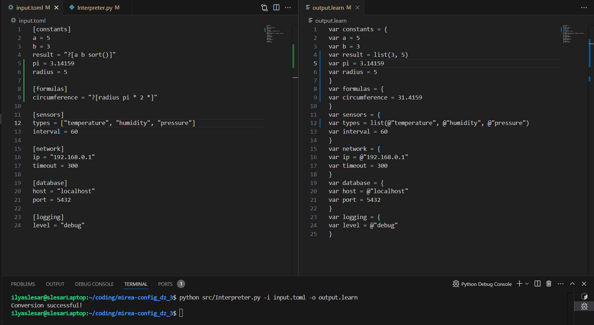
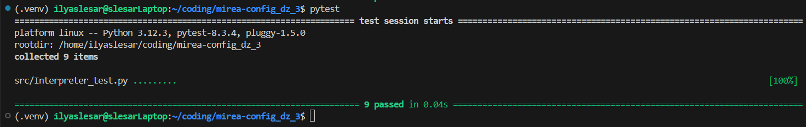

# Конвертер TOML в учебный конфигурационный язык

## Общее описание

Этот проект представляет собой инструмент командной строки, который преобразует файлы в формате TOML в текст на учебном конфигурационном языке. 

Конвертер поддерживает:
- Объявление переменных с различными типами данных (числа, строки, массивы).
- Вычисление выражений в постфиксной записи.
- Поддержку функций `concat()` и `sort()`.
- Рекурсивную обработку вложенных структур данных.

Инструмент предназначен для работы с файлами TOML, передаваемыми через командную строку. Результат записывается в файл в указанном формате.

## Описание команд для сборки проекта

```bash
git clone https://github.com/IlyaSlesar/mirea-config_dz_3.git
cd mirea-config_dz_3
pip install -r requirements.txt
python converter.py --input путь_к_входному_файлу.toml --output путь_к_выходному_файлу
```

## Описание всех функций и настроек
### Аргументы

- `--input`, `-i`: путь к входному файлу TOML (обязательный).
- `--output`, `-o`: путь к выходному файлу, куда будет записан результат (обязательный).

### Пример

```bash
python converter.py --input example.toml --output result.txt
```

### Структура учебного конфигурационного языка

- **Комментарии**:
  - Однострочные: `\ Это комментарий`
  - Многострочные: `/+ Это многострочный комментарий +/`
  
- **Типы данных**:
  - Числа: `42`, `3.14`.
  - Строки: `@"Это строка"`.
  - Массивы: `list(1, 2, 3)`.

- **Объявление переменных**:
  ```plaintext
  var имя = значение
  ```

- **Вычисление выражений**:
  - Запись выражений: `?[a b +]` (постфиксная форма).
  - Поддерживаемые операции:
    - `+` (сложение),
    - `-` (вычитание),
    - `*` (умножение),
    - `/` (деление),
    - `concat()` (конкатенация строк),
    - `sort()` (сортировка массивов).

## Примеры использования в виде скриншотов




## Результаты прогона тестов

Скрипт покрыт тестами для проверки работы с различными структурами данных. Запустите тесты с помощью `pytest`:

```bash
pytest
```

